# the-long-fork

[](https://londopy.github.io/the-long-fork/)
[](https://londopy.github.io/the-long-fork/tip/)

A repo whose only purpose is to be forked, one link at a time, as deep as
possible. Fork the **current tip** (never the root), add one line to
`CHAIN.txt`, and pass it on. The goal is the deepest fork-of-a-fork chain on
GitHub.

The code does nothing. The chain is the project.

> [!NOTE]
> Reading this inside a fork? This page may be out of date. The live tip is
> always in the root repo's [STATUS.txt](https://github.com/Londopy/the-long-fork/blob/main/STATUS.txt),
> and <https://londopy.github.io/the-long-fork/tip/> always takes you straight to it.

## The tip

<!-- TIP START -->
**No links yet.** Fork this repo to be link 1.

**Fork the tip:** <https://github.com/Londopy/the-long-fork/fork>

Your line starts with `1 | <your-username> | <YYYY-MM-DD> | 766aac5a6391 |`
<!-- TIP END -->

## Add your link

1. **Fork the tip** (the link above). Not the root, and keep the name `the-long-fork`.
2. In **your fork**, open `CHAIN.txt`, click the pencil, and add one line at the bottom:

   ```text
   <depth> | <your-username> | <YYYY-MM-DD> | <prev-hash> | <cell> | <note>
   ```

   | Field | What to write |
   | --- | --- |
   | depth | one more than the line above |
   | your-username | your GitHub username, exactly |
   | YYYY-MM-DD | today's date |
   | prev-hash | the first 12 characters of the SHA-256 of the line above yours (for the tip it's shown above) |
   | cell | `x,y=c` to set one cell of the shared 64 x 32 canvas (x 0-63, y 0-31, c any printable character except a space or `\|`), or `-` to skip |
   | note | optional: up to 80 plain ASCII characters, no links |

3. Commit it with the message `link <depth>: <your-username>`.

That's all. Don't change any other file, don't open a pull request (your
fork *is* your link), and don't delete your fork later.

The easy way: the **[link helper](https://londopy.github.io/the-long-fork/link/)**
reads your parent's `CHAIN.txt`, works out the depth and the hash, lets you
click a canvas cell, and gives you the exact line to paste.

The tracker walks the fork network twice a day, so you'll show up here, in
`STATUS.txt` and on the [site](https://londopy.github.io/the-long-fork/)
within about 12 hours.

### The hash by hand

Run one of these in a clone of your fork, before adding your line. It hashes
the last line of `CHAIN.txt`.

```bash
grep -v '^[[:space:]]*$' CHAIN.txt | tail -n 1 | tr -d '\r\n' | sha256sum | cut -c1-12
```

(On a Mac, use `shasum -a 256` in place of `sha256sum`.)

```powershell
$line = Get-Content CHAIN.txt | Where-Object { $_.Trim() } | Select-Object -Last 1
$sha = [Security.Cryptography.SHA256]::Create()
(-join ($sha.ComputeHash([Text.Encoding]::UTF8.GetBytes($line.TrimEnd())) | ForEach-Object { $_.ToString('x2') })).Substring(0, 12)
```

Or let Python write the whole line for you:

```bash
python tools/link.py --user your-username --cell 12,5=# --note "hello" --write
```

### Check your link

Turn on Actions in your fork (the Actions tab, then "I understand my
workflows, go ahead and enable them") and the **self-check** workflow runs on
every push and says whether your link is correct. It never commits anything.
Locally: `python tools/selfcheck.py`.

## The rules

The full text is in [RULES.txt](RULES.txt). In short: fork the tip, don't
rename, one commit that appends one line, don't touch other files, don't
delete your fork, one link per human (no alts, no throwaway orgs), and keep
notes clean (no links, ads or slurs).

## Branches

Two people will sometimes fork the same tip. That's allowed: the chain becomes
a tree. The **main chain** is the longest path from the root, and on a tie the
fork created first wins. Everything else is a side branch, and side branches
count too. If one grows longer, it becomes the main chain.

If no new link lands for 7 days, this page says **CHAIN STALLED**. That's the
cue to jump in: fork the tip, or start a side branch and overtake.

## The canvas

Each link may set one cell. This is the canvas as it stands at the tip.

<!-- CANVAS START -->
0 of 2048 cells set on the main chain.

```text
................................................................
................................................................
................................................................
................................................................
................................................................
................................................................
................................................................
................................................................
................................................................
................................................................
................................................................
................................................................
................................................................
................................................................
................................................................
................................................................
................................................................
................................................................
................................................................
................................................................
................................................................
................................................................
................................................................
................................................................
................................................................
................................................................
................................................................
................................................................
................................................................
................................................................
................................................................
................................................................
```
<!-- CANVAS END -->

## The tree

```mermaid
graph TD
  nf9ac21cf55a86945["0 · Londopy (tip)"]:::root
  classDef root fill:#1f2937,color:#ffffff,stroke:#111827
  classDef main fill:#dbeafe,color:#1e3a8a,stroke:#2563eb
  classDef tip fill:#2563eb,color:#ffffff,stroke:#1e3a8a,stroke-width:3px
  classDef side fill:#f3f4f6,color:#111827,stroke:#9ca3af
  classDef invalid fill:#fee2e2,color:#7f1d1d,stroke:#dc2626,stroke-dasharray:4 2
  classDef excluded fill:#e5e7eb,color:#374151,stroke:#6b7280,stroke-dasharray:4 2
  classDef lost fill:#fef3c7,color:#78350f,stroke:#d97706,stroke-dasharray:4 2
  classDef more fill:#ffffff,color:#6b7280,stroke:#9ca3af,stroke-dasharray:2 2
```

<!-- TREE START -->

<!-- TREE END -->

Every branch, with the reason any link doesn't count: [tree.txt](tree.txt).
Zoomable: [the site](https://londopy.github.io/the-long-fork/).

## Milestones

<!-- MILESTONES START -->
None yet. The first one is depth 10.
<!-- MILESTONES END -->

At depths 10, 25, 50, 100, 250, 500 and 1000 the tracker makes a release with
a snapshot of the chain and the canvas.

## What counts

The tracker checks every fork against the fork it was made from:

- your line has the right depth, your username and the hash of the line above;
- you added exactly one line and changed no other file;
- every line above yours was added by a real fork in the chain.

A link that breaks a rule is listed as INVALID, with the reason, and doesn't
count. If only your own line is wrong, the links after you still count. If a
fork rewrote lines above its own, nothing below it counts, because that part
of the chain can't be trusted anymore. If a link in the middle is deleted, the
links after it keep counting, and it shows as LOST.

## FAQ

**Why can't I fork again?** GitHub allows one repo per account in a fork
network, which is exactly why every link is a different person.

**I got my line wrong.** Fix `CHAIN.txt` with another commit, as long as
nobody has forked you yet. The tracker looks at the end result.

**Someone forked the same tip as me.** Keep going. Branches can overtake.

**Do I need Actions?** No. Only if you want the self-check.

**Is there a maximum depth?** GitHub doesn't document one. This project may
be the one to find out.

Maintainer notes are in [MAINTAINING.md](MAINTAINING.md).
